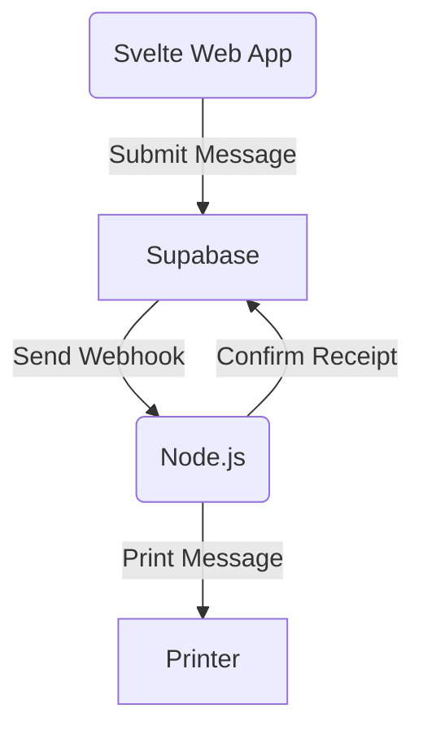

# Paper - A silly fax service just for me

## Architecture  


## Components  
### 1. **Frontend** (Svelte)  
- Hosted on Vercel or Netlify  
- Allows users to submit messages  
- Uses an anonymous Supabase client with rate limiting  

### 2. **Backend** (Supabase)  
- Hosted on Supabase  
- Tables:  
  - `messages` – Stores submitted messages  
- Row Level Security (RLS) to restrict data access  
- Webhook triggers on new messages  

### 3. **Printer Service** (Node.js)  
- Runs on Raspberry Pi Zero 2 W  
- Listens for webhooks from Supabase  
- Uses `canvas` to generate image data for printing  
- Communicates with printer over USB  

## Setup  
### Frontend  
1. Install dependencies:  
```bash
npm install
```
2. Add environment variables to `.env`:  
```bash
VITE_SUPABASE_URL=<your-supabase-url>
VITE_SUPABASE_ANON_KEY=<your-anon-key>
```
3. Start development server:  
```bash
npm run dev
```

### Backend  
1. Set up Supabase project:  
  - Use terraform, TODO


## Future Improvements  
- Add captcha for increased security  
- Add profanity filtering to allow or block certain words  
- Improve formatting of printed messages  

## License  
MIT  
